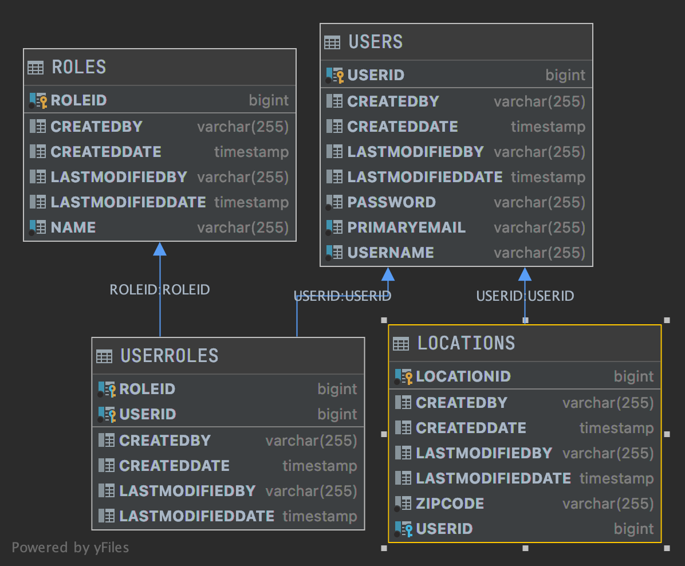

# Clear Weather App

## Table of Contents

- **[Overview](#overview)** 
- **[Database Schema](#db-schema)** 
- **[Project Setup](#project-setup)** 
- **[Swagger Documentation](#swagger-documentation)** 
- **[API Endpoints](#api-endpoints)** 

## Overview

Clear Weather App is a full stack web application that allows authorized and authenticated users to get weather information for US locations using 5-digit US zipcodes. 

### With Clear Weather App
1. A user can create a new account
2. A user can login to his/her account
3. A user can add a zipcode location
4. A user can delete a zipcode location
5. A user can view current weather information for all his/her locations

Clear Weather is a full stack web application composed of a front end React SPA providing the user interface and a Java Spring Web REST API using a PostgreSQL database. The front end application is deployed with Netlify and the backend is deployed with Heroku.

[Clear Weather App Live Site](https://clear-weather.netlify.app)

[Clear Weather App Front End GitHub Repo](https://github.com/ginabethrussell/apax_weather_frontend)

[Clear Weather App Back End BaseURL](https://gbr4477-apax-weather.herokuapp.com/)

## Database Schema

## Project Setup

#### The application was created as a modification of the Lambda School Backend Foundation application which was created in IntelliJ using the Spring Boot Initializer.

#### Note: The Java Spring Backend application utilizes OAUTH2 Authorization and Authentication requiring environment variables needed by both the local and the deployed application.

OAUTHCLIENTID, OAUTHCLIENTSECRET

### For PostgreSQL a Maven Dependency has been added to the POM file. 

A DataSourceConfig.java class allows the application to convert back and forth between a h2 in-memory db or a local postgresql db for development.

Heroku deployment includes the addon hobby-dev free version of postgreSQL.

### Deployment to Heroku using Maven

#### Setup Heroku from the CLI

heroku login

heroku create yourappname

heroku addons:create heroku-postgresql:hobby-dev -a yourappname

heroku config -a yourappname

heroku config:set OAUTHCLIENTID=lambda-client -a yourappname

heroku config:set OAUTHCLIENTSECRET=lambda-secret -a yourappname

Use the heroku GUI to access log

#### Inside the Java Application in IntelliJ

Add the plugin for heroku

    <finalName>yourappname</finalName>

    <!-- Heroku Maven Plugin Configuration -->
    <plugin>
        <groupId>com.heroku.sdk</groupId>
        <artifactId>heroku-maven-plugin</artifactId>
        <version>3.0.2</version>
        <configuration>
            <appName>${project.build.finalName}</appName>
            <includeTarget>false</includeTarget>
            <includes>
                <include>${project.build.directory}/${project.build.finalName}.jar</include>
            </includes>
            <jdkVersion>${java.version}</jdkVersion>
            <processTypes>
                <web>java $JAVA_OPTS -Dserver.port=$PORT -jar target/${project.build.finalName}.jar</web>
            </processTypes>
        </configuration>
    </plugin>

A SimpleCorsFilter.java class has been added to handle deploying and CORS issues with current settings allowing all origins.

Deploying from IntelliJ

To actually deploy, go to the 
Maven Tab

Turn on Skip Test Mode

Maven Goals

mvn clean heroku:deploy -X

You need to do this each time code is changed!

#### Additional notes on project setup and deployment are located inside the resource folder of the main application in the file DeploymentNotes.txt

## SwaggerDocumentation

[Swagger Documentation](https://gbr4477-apax-weather.herokuapp.com/swagger-ui.html)

Custom swagger API documentation was generated using swagger annotations on java models and controller routes.

## API endpoints

### https://gbr4477-apax-weather.herokuapp.com

### **_Authentication (for registration and login)_**

| Method        | Endpoint           | Body (required)                       | Notes                                             
| ------------- | ------------------ | ------------------------------------- | ------------------------------------------------- |
| register POST | /createnewuser | username, password, primaryemail | Creates a new user object in the database, logs in user, returns an access_token for authentication        |
| login POST    | /login    | username, password                    Returns an access_token for authentication |

### **_OAUTH Authentication Sample POST Requests_**

Create a new user and login:

    axios
        .post('https://gbr4477-apax-weather.herokuapp.com/createnewuser', newUser)
        .then((res) => {
            localStorage.setItem('access_token', res.data.access_token);
        })

Login an existing user:

    axios
        .post(
            'https://gbr4477-apax-weather.herokuapp.com/login',
            `grant_type=password&username=${loginFormValues.name}&password=${loginFormValues.password}`,
            {
                headers: {
                    Authorization: `Basic ${btoa('lambda-client:lambda-secret')}`,
                    'Content-Type': 'application/x-www-form-urlencoded',
                },
            }
        )
        .then((res) => {
				localStorage.setItem('token', res.data.access_token);
			})

### All other routes require an authenticated user. The access_token must be included in the request header.

Sample axiosWithAuth:

    export const axiosWithAuth = () => {
        const token = localStorage.getItem("token");
        
        return axios.create({
            headers: {
                Authorization: `Bearer ${token}`,
            },
            baseURL: "https://gbr4477-apax-weather.herokuapp.com",
        });
    };

### **_Endpoints for the Users_**

| Method                        | Endpoint                           | Body (required) |Notes                                                            |
| ------------- | ------------------ | ------------------------------------- | ------------------------------------------------- |
| get user GET    | /users/getuserinfo  | N/A             |  Fetches authenticated user      |
| get all users GET  | /users/users | N/A             | Fetches all users                  |
| get user by userid GET   | /users/user/:userid  | N/A       | Fetches user by userid  |
| get user by username GET  | /users/user/name/:username  | N/A           | Fetches user by username |
| get user by like username GET | /users/user/name/like/:subname | N/A        | Fetches users with subname in username |
| add a new user POST  | /users/user    | username, primaryemail, password | Adds a new user  |
| update a full user PUT | /users/user/:userid | username, primaryemail, password   | Updates entire user |
| update a user with partial info PATCH   | /users/user/:userid   | username, primaryemail, password | Updates the user  |
| delete user by userid DELETE | /users/user/:userid | N/A     | Deletes the user               |

### **_Endpoints for Locations_**

| Method                        | Endpoint                           | Body (required) | Notes                                                            |
| ------------- | ------------------ | ------------------------------------- | ------------------------------------------------- |
| get all locations GET | /locations/locations  | N/A           |  Fetches all locations   |
| get all locations for the user GET | /locations/getuserlocations  | N/A             |  Fetches locations added by user |
| get location by locationid GET | /locations/location/:locationid  | N/A       |  Fetches location   |
| add a new location POST | /locations/location/:userid/zipcode/:zipcode       | N/A | Adds location  |
| update a location PUT | /locations/location/:locationid/zipcode/:zipcode | N/A |  Updates the location |
| delete location by locationid DELETE | /locations/location/:locationid | N/A                | Deletes the location  |

### **_Endpoints for Logout_**

| Method                        | Endpoint                           | Body (required) | Notes                                                            |
| ------------- | ------------------ | ------------------------------------- | ------------------------------------------------- |
| logout user GET | /logout  | N/A           |  logs out user   |

